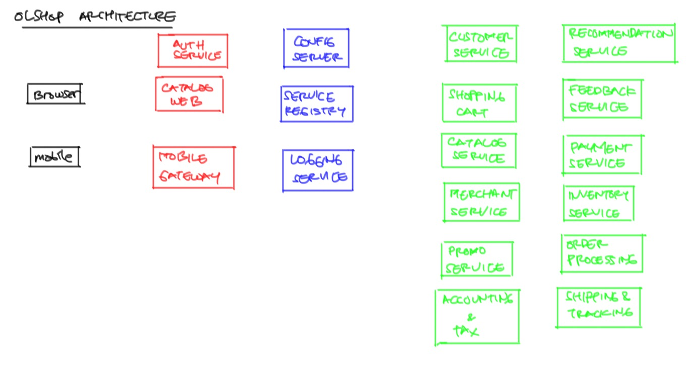

# Belajar Spring Cloud #

Studi Kasus :

Aplikasi online shop yang dibuat dengan microservice. Daftar semua modul terlihat seperti ini:

Keterangan:

* hitam : user/client apps
* merah : service yang bisa diakses dari user
* biru : service infrastruktur, untuk mengkoordinasikan service lain
* hijau : service internal, tidak bisa diakses langsung dari luar

## Komponen Aplikasi ##

* folder config : repository config yang akan dibaca oleh Config Server
* config-server : microservice yang menghosting semua konfigurasi service lain
* discovery-service : microservice yang bertugas untuk menyimpan daftar semua service. Terdiri dari 2 instance untuk keperluan failover
* catalog-service : microservice untuk menyediakan REST API daftar produk dan informasi produk
* catalog-web : aplikasi web yang menggunakan `catalog-service` untuk menampilkan daftar produk dalam format HTML/website
* reverse-proxy : microservice untuk menjadi pintu masuk semua request, kemudian mem-forward request ke service yang berwenang
* auth-service : microservice untuk login

## Config Server ##

Cara menjalankan:

1. Masuk ke foldernya

        cd config-server

2. Jalankan

        mvn clean spring-boot:run

3. Coba akses konfigurasi aplikasi `catalog` dengan profile `testing`

        curl http://localhost:8888/catalog/testing

4. Periksa outputnya, seharusnya seperti ini
        
        {
          "name" : "catalog",
          "profiles" : [ "testing" ],
          "label" : "master",
          "version" : "4bf57b8c943d17ff8b4664a8a70f93080c134a36",
          "state" : null,
          "propertySources" : [ {
            "name" : "https://github.com/endymuhardin/belajar-springcloud.git/config/catalog/application-testing.yml",
            "source" : {
              "nama" : "Test User"
            }
          }, {
            "name" : "https://github.com/endymuhardin/belajar-springcloud.git/config/catalog/application.yml",
            "source" : {
              "server.port" : 30001,
              "spring.datasource.url" : "jdbc:mysql://localhost/belajar",
              "spring.datasource.username" : "belajar",
              "nama" : "Development User",
              "spring.datasource.password" : "passwordDBdevelopment"
            }
          }, {
            "name" : "https://github.com/endymuhardin/belajar-springcloud.git/config/application.yml",
            "source" : {
              "spring.jackson.serialization.indent_output" : true
            }
          } ]
        }

5. Bila `spring.datasource.password` tidak terdekripsi, jalankan `config-server` dengan environment variable `ENCRYPT_KEY`

        ENCRYPT_KEY=inisymmetrickeyrahasiasekali mvn clean spring-boot:run

6. Bila mendapatkan output seperti dibawah ini, pastikan kita sudah menginstal Java Cryptography Extension seperti dijelaskan [di sini](http://stackoverflow.com/a/6481658)

        {
          "timestamp" : 1483025777244,
          "status" : 500,
          "error" : "Internal Server Error",
          "exception" : "java.lang.IllegalArgumentException",
          "message" : "Unable to initialize due to invalid secret key",
          "path" : "/encrypt"
        }

7. Sedangkan bila mendapatkan error seperti ini, berarti kita tidak memasang symmetric key dengan benar.

        {
          "description" : "No key was installed for encryption service",
          "status" : "NO_KEY"
        }

8. Selanjutnya, `config-server` ini seharusnya kita deploy ke cloud service seperti Heroku supaya mendapatkan hostname yang permanen. Soalnya nanti semua aplikasi lain akan mengambil konfigurasi dari `config-server` ini.

9. Bila ingin mengenkrip suatu nilai, misalnya `1234`, kita bisa menggunakan endpoint `/encrypt` seperti ini

        curl http://localhost:8888/encrypt -d 1234

   dan mendapatkan hasil seperti ini

        59e78e6f57c36a0e2347cf1f68ae7772594e1f77b3cb2bb358baf447cd304eda 

10. Nilai tersebut bisa kita pasang di file konfigurasi seperti ini

        password: {cipher}59e78e6f57c36a0e2347cf1f68ae7772594e1f77b3cb2bb358baf447cd304eda

## Referensi ##

* http://www.kennybastani.com/2016/04/event-sourcing-microservices-spring-cloud.html
* https://www.youtube.com/watch?v=cCEvFDhe3os
* https://www.youtube.com/watch?v=5q8B6lYhFvE
